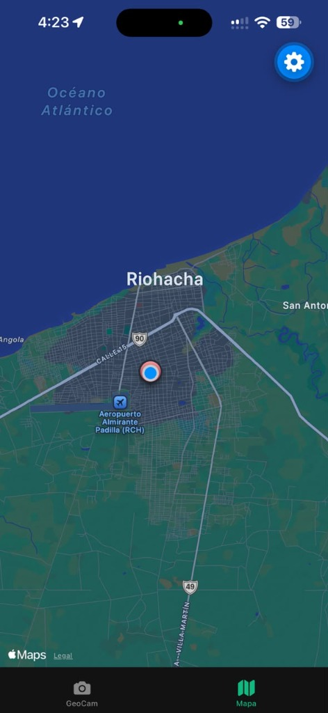

# GeoCam — Modulos Nativos y Sensores del Dispositivo

Aplicacion movil desarrollada con **Expo**, **React Native** y **TypeScript** para el Taller Integrador de la Semana 6.

**Desarrollador:** Camilo Gomez  
**Semana:** 6 — Modulos Nativos y Sensores del Dispositivo  

---

## Caracteristicas Principales

- **Camara Nativa (`expo-camera`)**: Vista previa fluida con `CameraView`, alternancia de camara frontal/trasera y proteccion contra dobles toques simultaneos.
- **Geolocalizacion Reactiva (`expo-location`)**: Maquina de estados completa de permisos (`checking`, `undetermined`, `granted`, `denied`, `blocked`), lectura puntual bajo demanda y seguimiento continuo con coordenadas en vivo.
- **Degradacion Elegante**: Si el usuario rechaza la ubicacion, la camara sigue funcionando normalmente y las fotos se almacenan con `coords: null`.
- **Selector de Galeria (`expo-image-picker`)**: Importacion de fotos de la galeria distinguidas visualmente con insignias de origen (camara vs galeria).
- **Sensor de Movimiento (`expo-sensors`)**: Deteccion de agitacion del telefono (shake) mediante el acelerometro con umbral de fuerza, frecuencia de 100 ms y tiempo de enfriamiento (cooldown) para confirmar el borrado masivo de fotos.
- **Mapa Interactivo (`react-native-maps`)**: Marcadores interactivos para fotos geolocalizadas con Callouts que muestran la miniatura, y panel inferior horizontal para fotos sin ubicacion.
- **Estado Global Inmutable (`GeoPhotosContext`)**: Manejo centralizado y seguro de la coleccion de fotos en memoria.

---

## Captura de la Aplicacion en Dispositivo Fisico (iOS / Expo Go)

<p align="center">
  
</p>
<p align="center"><em>Pestaña Mapa ejecutandose en telefono fisico con deteccion GPS y centrado de ubicacion en tiempo real (Riohacha, Colombia).</em></p>

---

## Estructura del Proyecto

```text
semana-6/
├── app/
│   ├── (tabs)/
│   │   ├── _layout.tsx           # Configura las 2 pestañas y envuelve en GeoPhotosProvider
│   │   ├── geocam.tsx            # Pestaña 1: Camara, coordenadas en vivo y disparo
│   │   ├── mapa.tsx              # Pestaña 2: Mapa interactivo nativo (iOS/Android)
│   │   └── mapa.web.tsx          # Pestaña 2: Vista adaptada para navegadores web
│   ├── _layout.tsx               # Root Layout con Stack y StatusBar
│   └── index.tsx                 # Redireccion a /(tabs)/geocam
├── components/
│   └── PermissionPrimer.tsx      # Explicacion en contexto y boton "Abrir Ajustes"
├── context/
│   └── GeoPhotosContext.tsx      # Contexto inmutable para almacenar fotos
├── hooks/
│   ├── useCamera.ts              # Hook nativo para CameraView y permisos
│   ├── useGeoLocation.ts         # Hook nativo para GPS y seguimiento
│   └── useShake.ts               # Hook con acelerometro y umbral de agitacion
├── screenshots/
│   └── mapa_ubicacion.jpg        # Evidencia de ejecucion en dispositivo fisico
├── types/
│   └── geo.ts                    # Modelos de datos TypeScript (Coords, GeoPhoto, PermissionState)
├── app.json                      # Configuracion de Expo y plugins nativos
├── AI-LOG.md                     # Registro de auditoria de IA y deteccion de alucinaciones
├── GUIA_DESARROLLO_GEOCAM.md     # Guia detallada del proyecto
└── README.md                     # Documentacion general y evidencia de pruebas
```

---

## Maquina de Estados de Permisos

GeoCam implementa la maquina de estados de permisos requerida:

```text
checking ──> undetermined ──> (acepta)  ──> granted
                          ──> (rechaza) ──> denied ──> (rechaza de nuevo) ──> blocked
blocked  ──> Linking.openSettings() ──> (habilita en Ajustes) ──> granted
```

### Evidencia de los Estados de Permisos

| 1. Permiso Concedido (`granted`) | 2. Permiso Rechazado (`denied`) | 3. Permiso Bloqueado (`blocked`) |
| :---: | :---: | :---: |
| Camara activa con coordenadas GPS en vivo (ej. `11.544, -72.907`) | Camara activa sin GPS. Muestra banner superior: "Activa la ubicacion para etiquetar tus fotos" | Pantalla PermissionPrimer con boton directo: "Abrir Ajustes" |
| Visible en pestaña Mapa con ubicacion en tiempo real (Riohacha) | Las fotos se guardan con `coords: null` y se agrupan en "Sin ubicacion" | Redirige al menu de permisos de iOS / Android mediante Linking |

---

## Instrucciones de Ejecucion

1. Instalar las dependencias del proyecto:
   ```bash
   npm install
   ```

2. Iniciar el servidor de desarrollo de Expo con soporte para tunel:
   ```bash
   npx expo start --tunnel
   ```

3. Abrir la aplicacion **Expo Go** en un dispositivo fisico (Android o iOS) y escanear el codigo QR mostrado en la terminal.

---

## Pruebas Realizadas

- [x] **Permisos en contexto**: La aplicacion no solicita permisos al arrancar; se consultan pasivamente de fondo y se solicita autorizacion solo por accion del usuario.
- [x] **Degradacion elegante**: Al denegar la ubicacion, las fotos se guardan correctamente y se listan en el panel "Sin ubicacion" del mapa.
- [x] **Redireccion a Ajustes**: Cuando el permiso se encuentra bloqueado, el boton conduce directamente al panel de ajustes del sistema operativo.
- [x] **Limpieza de recursos**: Todas las suscripciones a sensores (`Accelerometer`) y GPS (`watchPositionAsync`) se liberan mediante `.remove()` y la bandera `cancelled` al salir de la pantalla.
- [x] **Ejecucion en dispositivo fisico**: Verificado en iPhone con iOS mediante Expo Go, validando mapa interactivo nativo, deteccion de ubicacion y navegacion por pestañas.
